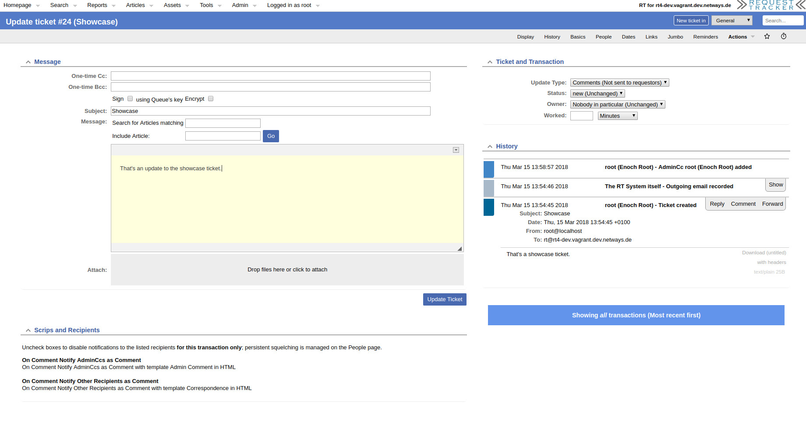
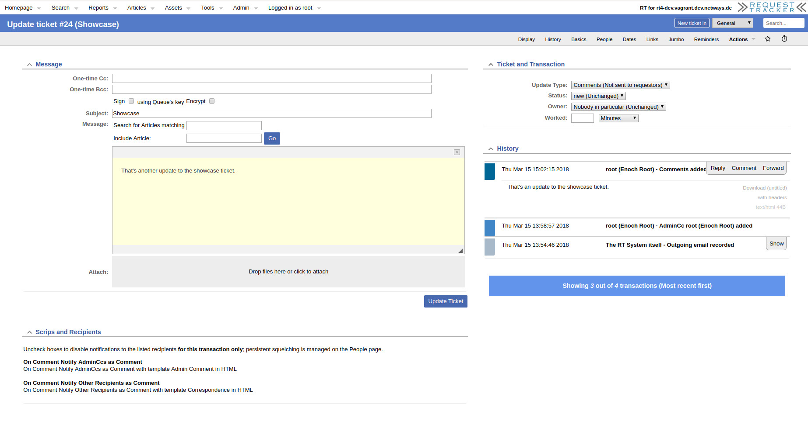

# RT-Extension-UpdateHistory

#### Table of Contents

1. [About](#about)
2. [License](#license)
3. [Support](#support)
4. [Requirements](#requirements)
5. [Installation](#installation)
6. [Configuration](#configuration)

## About

The default behavior of RT when adding a comment or reply is to not display the ticket's history.

This extension adds an additional element to the sidebar where an configurable amount of recent
activities are listed.

## License

This project is licensed under the terms of the GNU General Public License Version 2.

This software is Copyright (c) 2018 by NETWAYS GmbH [support@netways.de](mailto:support@netways.de).

## Support

For bugs and feature requests please head over to our [issue tracker](https://github.com/NETWAYS/rt-extension-updatehistory/issues).
You may also send us an email to [support@netways.de](mailto:support@netways.de) for general questions or to get technical support.

## Requirements

- RT 4.4.2

## Installation

Extract this extension to a temporary location.

Git clone:

    cd /usr/local/src
    git clone https://github.com/NETWAYS/rt-extension-updatehistory

Tarball download:

    cd /usr/local/src
    wget https://github.com/NETWAYS/rt-extension-updatehistory/archive/master.zip
    unzip master.zip

Navigate into the source directory and install the extension. (May need root permissions.)

    perl Makefile.PL
    make
    make install

Edit your `/opt/rt4/etc/RT_SiteConfig.pm`

Add this line:

    Plugin('RT::Extension::UpdateHistory');

Clear your mason cache:

    rm -rf /opt/rt4/var/mason_data/obj

Restart your webserver.

## Configuration

**$UpdateHistory_MaxEntries**

The maximum number of history entries to list. If not set, everything is listed.

### Example

    # Limits the number of history entries shown when updating a ticket
    Set($UpdateHistory_MaxEntries, 10);
